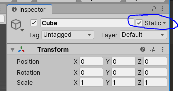

# Lighting In Unity

## Realtime vs. Baked
There are two ways to render lights in 3D, on simulated materials. The first is realtime, and the second is "baked". Realtime means that we calculate how the material looks every frame. Baked lighting means that the engine renders -in advance- how the light bounces all around, and then changes the look of various materials/textures in the scene accordingly. 

More information in the [Unity Manual](https://docs.unity3d.com/Manual/LightingInUnity.html)

This way, one is not limited by the framerate of the scene. Of course, we can't have dynamic realtime shadows and the objects can't really move around much.

In unity, both Mesh Renderers (the surface) and the lights themselves have a setting to be realtime or baked.

For the objects, we need to select **static**, in the top right of the GameObject settings in the inspector. This tells Unity that the object won't be moving, and we should calculate it's lighting in advance.

Most light types, in Unity, have a "Mode" dropdown. This is the [lighting mode](https://docs.unity3d.com/Manual/LightModes.html) where the options are Realtime, Mixed, or Baked. Realtime and Baked are self explanatory. Mixed has it's own sub-options, and is largely used to allow static gameObjects to cast shadows onto dynamic (non-static) gameObjects, by setting it to *Baked Indirect* or *Shadowmask*. More information: [Lighting modes in Unity Manual](https://docs.unity3d.com/Manual/LightModes.html).

#### Types of Light
The [Types Of Light](https://docs.unity3d.com/Manual/Lighting.html) page in the Unity Manual explains the various types well.

## Setting up a Scene with Lights

#### Set Static Property on GameObjects
First, determine which objects should be static, and which ones shouldn't be. Set various objects and their children objects accordingly. Roughly, set gameObjects to Static if they never move. 

#### Add Lights
Next, set up your lights in the scene.

You need lights where lights should be, a directional light for the "sun", if required, emissive materials for screens and fancier 3D models, and so on. I tend to simplify complex light shapes into point lights, but that's a bad habit. It depends on the scene.

Go to *Window > Rendering >Lighting Settings*, and set your environmental/ambient light setting appropriately. This is a "sourceless" light that I think of as a "shadow-fill", your base brightness. It can keep your scene from looking too dim.

Normally light bounces around to lift up shadows and cracks, but we aren't simulating a lot of this indirect/bouncing light, so ambient "Environmental Lighting" works well to fake this, and prevents your scene from being too dramatic or gloomy.

#### Configure Shadows
Shadows are computationally expensive, but they also are pretty important for a scene to look good. Double check you aren't casting shadows where you don't need to be, and if you can use shadows with baked lights instead of realtime ones, do that. Especially for Deploying to the Oculus Quest.

Shadows can go missing from a number of different settings:
1. Lights have a "Cast Shadows" option.
2. Renderers have a "Cast Shadows" option.
3. Renderers have a "Revieve Shadows" option.
4. Your light's distance could be too short.
5. Realtime/baked setting confusion
6. Something else, who knows. Good luck!

#### Configure Reflections
We don't generally have our shiny surfaces actually bounce and reflect light. Instead, we fake it. In order to fake it, we use something called a "Reflection Probe".

A reflection probe basically captures a 360 image from a certain location and stores it, and then nearby shiny objects use that to figure out how they should reflect light.

If you have a mirror, put a reflection probe component on it, or on an empty gameObejct near it. Or in the middle of the room in front of it (*GameObject>Light>Reflection Probe*). Now fiddle until it looks good. Better yet, read the [manual](https://docs.unity3d.com/Manual/ReflectionProbes.html) on the subject.

Reflection Probes won't work until the lighting has been baked.

*A unity scene before a reflection probe was added:*

*A unity scene after a reflection probe was added as a component of the sphere.*

### Conclusion
That's the basics. You may have noticed that this guide includes a lot of links to the unity manual. That's no coincidence. Now that you know the various things you need to do, check out the manual when you need to dig deeper or figure out how something is working in more detail.

