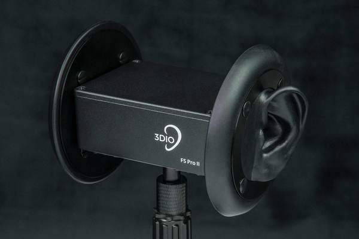

# How To Perceive Space - Acoustics
## Vocabulary
- **Level**: The level of an audio signal is it's loudness. The term spread outside the context of audio signals (like microphone cables) into generally speaking about audio.
- **Phase**: A position in a waveform cycle. 
	- Walk next to someone else with the same stride length. Steps in sync? you're in the same phase. If the person next to you has a different stride length, thats a difference in **wavelength**.
- **Stereophonic Sound/Stereo**: Using multiple speakers that reproduces audio in a way that is perceived as directional. A broad term.
- **Timbre**: Tone. Perceived sound quality. Characteristics of sound. Think of it as the properties of the sound that make that sound unique compared to other sounds (like different instruments all playing the same note).

## Hearing Environments
Many things around us produce a sound. Theres the obvious sound producing things like people, speakers, and background noise like cars and birds. But there's so much more. Air conditioners. Computer fans and hard disks. Refrigerators. My cat. Radiators. A house "settling". The hum of certain electronics. There's sounds of everything we/others do - rustling clothes, wheeled chairs, breathing, footsteps, and more. All of these sounds are unique to their environment. The particular timbre, the volume, the collection and arrangement. Every environment is unique, and ever environment uniquely affects the sounds with in it, with reverberation. Every space has its own sound. 

How we perceive the space is largely informed by this sound. We also use it to inform our own location within the space, and we can get a sense of the scale, the "character" or "mood", and more of a space from its acoustic properties.

Never underestimate sound design.

Everything around us affect the way things sound

> Scientists studying hearing aids in the 50’s came to an important conclusion: It is more comfortable to listen to somebody when we can accurately locate them auditorily. (Raymond Carhart)

Design wise, consider that it is more comfortable not just to listen to somebody, but to interact with anything when the interaction is reinforced auditorily, and not just visually. And, outside of interactions, for en environment to impact us - for us to *feel* the space, to achieve that sense of presence in VR, we need environments to sound appropriate. 

## Sound Localization - Why
"Localization" is identifying the location of the source of a sound, specifically or generally. We are not pin-point accurate, but even broad/blurry understandings can be helpful!

For example, even the most broad of understandings can help locate ourselves within an environment and help us understand our location when we move or turn. Localization is a process relative to the listener. We can use sounds to locate ourselves, not just locate the sounds position.

> Consider the last room you watched TV inside of. You could be teleported blind to anywhere in that room and you would know where you were in that room from the audio cues alone.

We use sound to stay aware of moving objects in an environment. I am typing right now and I know exactly where my cat is. I know where conversations are taking place at a house party, and when someone approaches my office to enter compared to walk past.

##  Sound Localization - Okay but how does it work.
We are better at localizing sound on the horizontal plane then the vertical.

### Level Difference
Sound loses energy as it travels, and even the difference it loses between our ears is significant enough to work with. Is a sound louder in this ear? It's to the left.

> Of course, it's also louder because of the direction our ears are pointing. A cat can angle and change their ears directions in order to sense the environment in different ways. 

Consider how when you are trying to listen for something and you don't know where it's coming from, you rotate your head about in a sort of "scanning" behavior. 

### Time Difference
Sound travels fast! But not [that fast](https://en.wikipedia.org/wiki/Speed_of_sound).

Sound in front of us will reach our ears about the same time, but sound to the sides will reach one ear before the other.

For impulse sounds, we can identify the time difference it took for the sound to reach our ears to localize it. Neat!

### Phase Difference
But what about continuous sounds? Surely if there is no start or stop time, this doesn't helps us at all? Wrong! Our brains can identify the *phase difference* and localize sound from that.

This, of course, works better for certain frequencies (wavelengths) - very high pitched sounds have such a short wavelength, it can be hard to identify the phase difference. Same for lower frequencies.

Sound above or below us is more challenging to locate, as wll as sound from highly reverberant environments.

> **BONUS THINKS**: What makes a sound, as we colloquially describe and think about it, "high" or "low" in pitch? What makes it's pitch "normal"? What informs this categorization? Could our ability to localize sounds in certain frequencies more easily affect how we feel or think about the sound? Does our ability to localize a sound affect how comfortable it is to listen to that sound?

### Head Masking Effect/Head Shadow Effect
The difference a sound has between our ears can get muffled by our head. Sound from different directions will get muffled, and we use this information to inform our localization.

By "muffled", it will generally have a variety of different audio characteristics/frequency responses.

### Ear Shape
The shape of our ear matters. You know, ears. They have that little flap the pinnae, the ridges, all that weird stuff. These introduce slight differences in frequency response to a sound depending on the angle the sound entered our ear from. 

Sound coming from the front will travel into our ear a different way than sound coming from the side, and that difference will affect the sound. We can use the differences to localize the audio's source.

> Our brain, in processing this information, will generally disregard and normalize these differences - you don't "notice" it, actively. The sound sounds the same to you regardless of where it comes from. In fact, even differences we can hear can be hard to notice. 

One way to simulate this effect is not to simulate it digitally at all. Instead, just record with a microphone that also has the same shape. In other words: a microphone with weird rubber ears. This is called a **binaural** microphone. Listening to these recordings with headphones can be quite remarkable. Compared the effect to listening without headphones.

### Reverberation, Signature and Tone
Every environment sounds different. Sound travels directly from the source to the listener. Sound also travels all around the environment, where it bounces off of things ("picking up" new acoustic properties) and then traveling to the listener. It took longer for these sounds to reach the listener than the direct. We call these indirect sounds "reverberation". 

Reverberation and room tone are very important for VR, but this is not the space for a detailed discussion or investigation. In regards to localization, reverberation can be localized just like direct sounds can. Often with less precision. Reverb gives us a general sense of a room. As we turn around in it, reverb is a part of what allows us to place ourselves in the room. This technique, taken to a precise extreme, could be called echolocation. [Humans have, with practice](https://en.wikipedia.org/wiki/Human_echolocation), learned to echolocate. For most of us, the awareness of reverberation as it relates to our location is extremely vague, and generally just cues us into rough orientation. 

When it comes to design, reverb is far more important in helping inform the user into architectural properties of the environment. Particularly scale and material. A small underground cave will sound different than a large cavern, which will sound different than a wooden hut.   

> Consider this next time you walk down a stairwell. Many stairwells are highly reverberent, it's easy to identify the sounds. The direct sounds of your footsteps never really change location, but as you approach the bottom of the stairwell, the reverberation of the footsteps changes. Your ears tell you that you are near the bottom (i.e.: it's time to look up from your phone).

Reverb is easy to fake, and "inject" into audio recordings. Adding "fake" reverb to a recording is a fundamental tool in a sound engineers toolkit.

It's challenging, but not impossible, to simulate reverb in VR. As designers, we should be aware of the ways to add reverb to our sounds in order to help sell a particular environment, and make it feel impactful.

## Takeaways
Most of the above information deals with sound traveling directly to our ears. What can we do with this information?

We are better at localizing sounds on a horizontal plane than vertical. avoid putting key acoustic information directly above or below the player. 

> Consider a direct example for the need to localize sound. A "beacon" system that allows players to point out a location by pointing at it, and having it make a visual and acoustic effect. Beacons are often used in multiplayer experiences. Consider if someones points near someones feat, or nearby. We want it to be easy for the player to tell if they fired the beacon to the side, or behind, the player. We could check if we are close to a user, and if so, add a second invisible sound source above the ground, closer to the horizontal plane of the users ears, in order to better communicate the beacons directionality to that user. It could just play the same sound effect, or carry direct-not-reverberent audio only.

Certain Frequencies are easier to localize than others. Ensure sounds of important elements include these "normal" frequencies in their design.

### Ambiance in VR Design
Sound design theory from games involves making sounds big, punchy, and attention getting - high impact. Great for reactive and informative sounds in our environments! But we do more than that. We also need *ambient sounds*. Sounds that are designed to just subtly reinforce the sense of presense, environment, and mood.

**They help the user locate themselves in the environment as they move about.** They also are important for design, ambient sound informs the player a lot about mood and atmosphere of spaces.

> Background audio also helps cut out sounds from the "real world". How can a quiet VR experience happen inside of a room that is not quiet? The users real-world sounds conflict, and lower the degree of immersion. 

These sounds should not be designed in a way to get the users attention, or incorrectly indicate importance. This is a challenge. It goes against many users learned preconceptions about designed environments. *"That this is buzzing - lets investigate!"*

One strategy is to have sounds come from important things. Give your environment ambiance via it's significent elements. In other words: bypass the problem! Excellent.

Another strategy is to use items that users have already been trained in real life to ignore or deemphasize. For example, speakers playing diegetic background music, birds chirping outside of a window, cars drumbling past a road outside, or fans. (I would tend to avoid things that sound unique but don't have a visible source, like an air conditioner hum).

## Interesting/Related
- The field of "Psychoacoustics" is worth a wikipedia dive at least
- [Duophonic Sound](https://en.wikipedia.org/wiki/Duophonic)
- Cocktail Party Effect