# How To Perceive Space - Vision
First, one must attempt to understand the degree to which our understanding of our space is not one of merely looking at the space. There is a phenomenal degree of what we might call "processing". We do a lot of work to go from looking at an environment to accurately understanding the world around us. What we see is not what we get. 

We must understand many of the tools and tricks that our brains use to correctly perceive space in order to better present space. 

## Vocabulary

## We See Depth
Understanding and perceiving our space is largely a process of understanding depth. We can only look in one direction at a time, and we really only look at one *thing* at a time.

Eyes receive light projected through their lens onto photo receptors in the back of the eye. These photoreceptors are not depth sensors. They detect light and color. They don't know anything direct about how far away any ray of light came from. Our brains have to deduce depth from a variety of cues, merging them all together to an understanding of space. This page covers most depth cues the human vision system uses. 

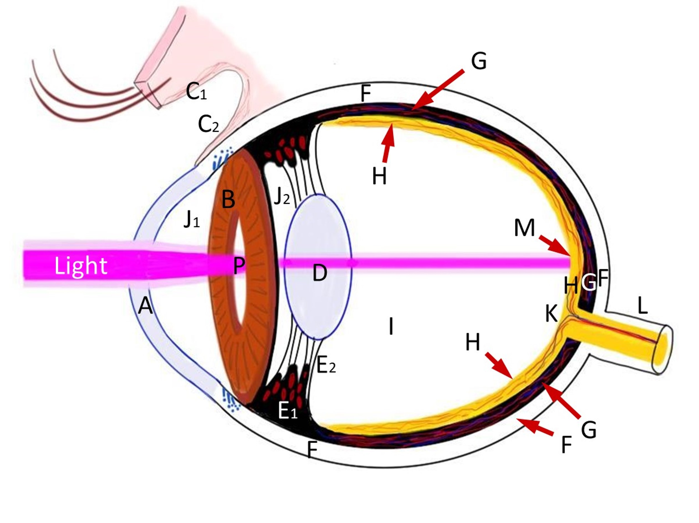
*Eye Diagram by Chris Sullivan. [Wikimedia Commons](https://commons.wikimedia.org/wiki/File:Eye-Diagram-Cartoon-Eyeball-2019_02.jpg).* [Here](https://commons.wikimedia.org/wiki/File:Eye-Diagram-Cartoon-Eyeball-2019_04.jpg) is a version with labels.

There is much more to talk about when it comes to vision and how we construct a mental model ("understanding") of a space. This page will focus on the understanding of depth, which is the principle tool used in this process.

### Stereoscopy
Comparing The difference between the image received by our eyes.

Consider that for objects that are very far away, there is almost no difference between the image projected onto both of our eyes. Stereo vision has limits to it's accuracy, and that accuracy is directly related to distance.

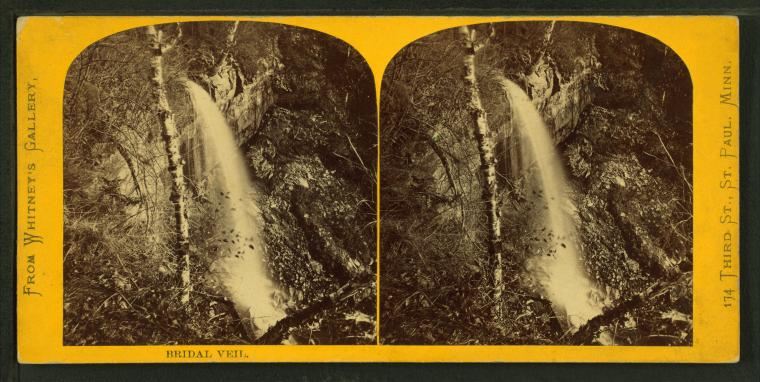
A stereo print. From the [NYPL archive](https://digitalcollections.nypl.org/items/510d47e0-914e-a3d9-e040-e00a18064a99).

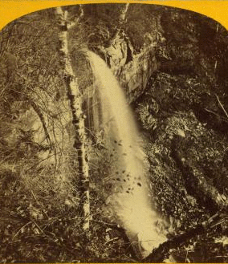

The above image animated using the NYPL [Stereogranimator](http://stereo.nypl.org/) tool.

### Convergence
We are aware of our eye muscles, and the angle they are looking. Go cross-eyed. Now look very far away. As we focus on different objects at different distances, our eyes are angled at different amounts (from cross-eyed to parallel). We feel this angle, and thus have an idea of how far away we are looking. 

Again, it's limits involve the difference between distances very far away, as well as objects extremely close.

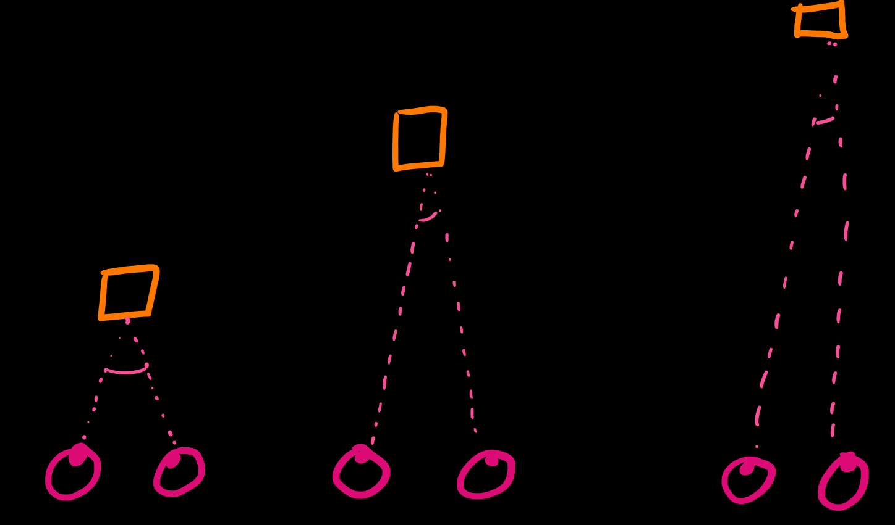

### Accommodation
Similar to *Convergence*, Accommodation is also a sense of muscles in our eyes. But it's the sense of the muscles we use to alter the shape of the lens in our eye (D, above) to refocus light that is coming from different angles. Different angles means different distances.

Accommodation is the most similar to how regular camera optics work.

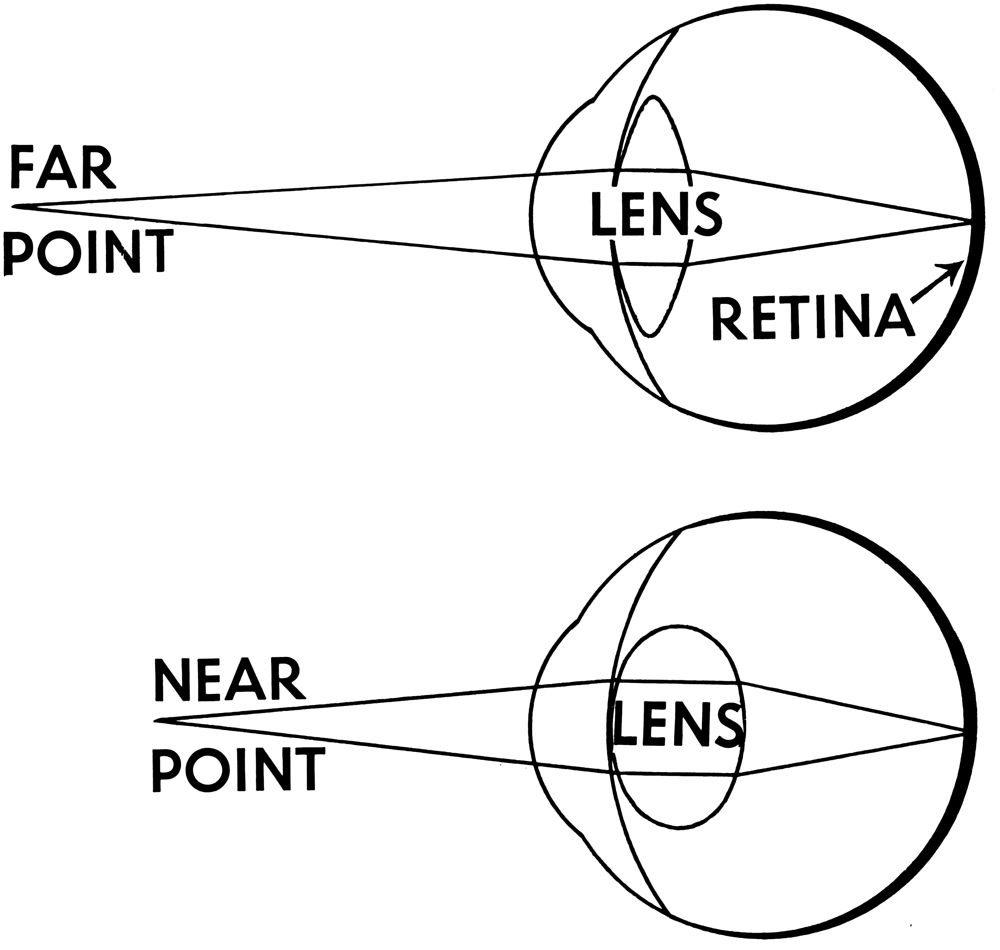
*[Accommodation Diagram](https://commons.wikimedia.org/wiki/File:Accommodation_(PSF).png) from Pearson Scott Foresman archives. CC0.*

### Linear Perspective
Perspective is a lot to cover, I will assume you understand the basics. More [resources](PerspectiveDistortionAndProjections.md) on perspective will be available soon.

It's one of the most important depth cues that we have for understanding environments. The reasons photographs and renaissance paintings "look real" is their use of perspective that matches our expectations and perceptions of space well.

There is a lot to be said about what can be achieved by breaking and cheating with linear perspective, but in VR, this tends to be outside of our control as designers. Instead, we need to know how to reinforce and manipulate the effects of perspective. We do this by providing architectural environments with clear angles and visible straight lines/edges (or not), by letting our environments extend to the distance (or not) and being sure not to confuse perspectives in one environment. 

While one might think that the virtual camera achieves linear perspective for us, in 3D engines that we are producing VR inside of, the boring truth is that it's just not enough. Open up a VR scenes and float some cubes around you. Do you know how large they are? How far away they are? Probably not. Ground your objects inside of scenes - like rectangular rooms with repeating details, give the ground and walls texture, like tiles floors - and otherwise provide the visual information that becomes perspective cues when projected in linear perspective.

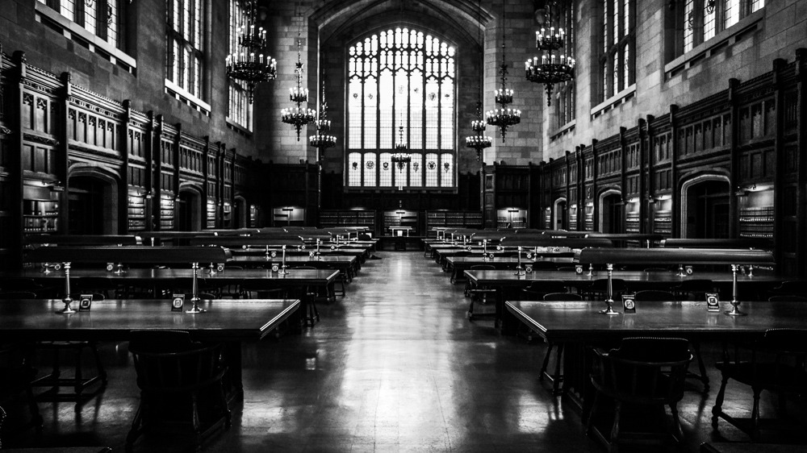
*University of Michigan Law Library. An image with strong linear perspective, there's a clear vanishing point in the center of the image.*

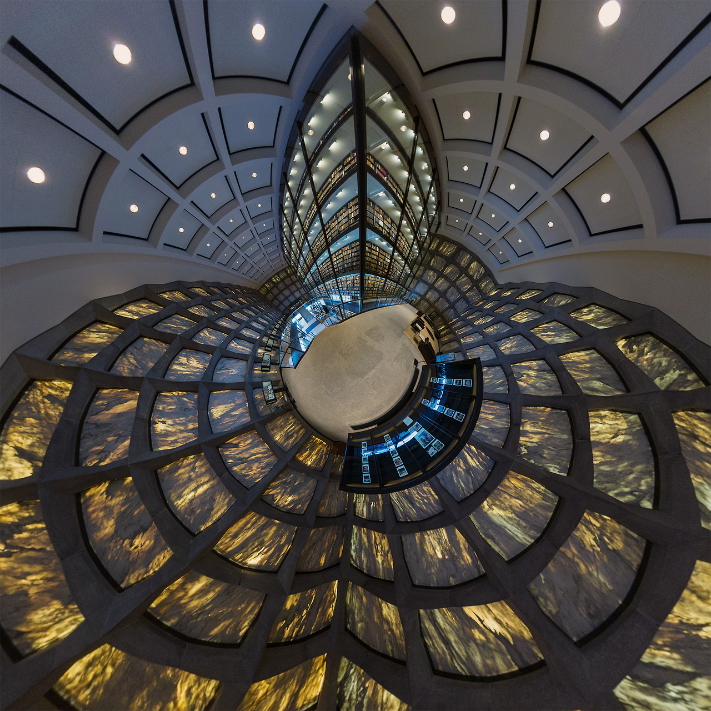
*This image of [Yale's Library](https://upload.wikimedia.org/wikipedia/commons/3/36/20170420_Beinecke_Rare_Book_Library_Interior_Yale_University_New_Haven_Connecticut.jpg) was shot with non-linear projection. Straight lines are not straight, and parallel lines are not parallel nor do they converge to a single point. This image uses [stereographic projection](https://en.wikipedia.org/wiki/Stereographic_projection).  

The below image is off-putting because it showcases two perspectives - one on the projected screen, the other in the art gallery - that are incompatible. As a photography, that's why I like this iamge - it *doesn't* work. It's clear why, but is still uncomfortable to look at. The on-screen perspective is *close* to the real camera perspective, so our brains make an attempt at fitting it all together. We want to bend the world and make it work. It doesn't.

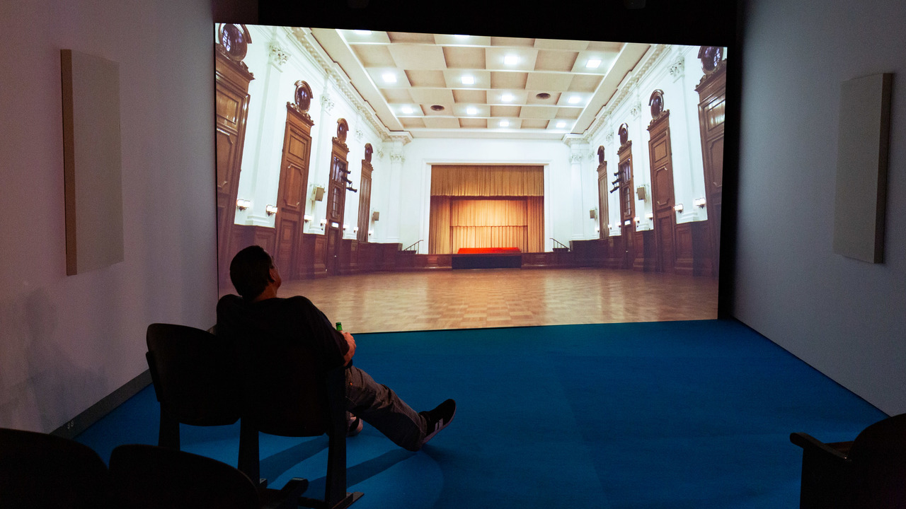

This image is an equirectangular projection of a 360 image captured from the center of a radially symmetric room. Everything is the same distance away, so it's all the same size. 
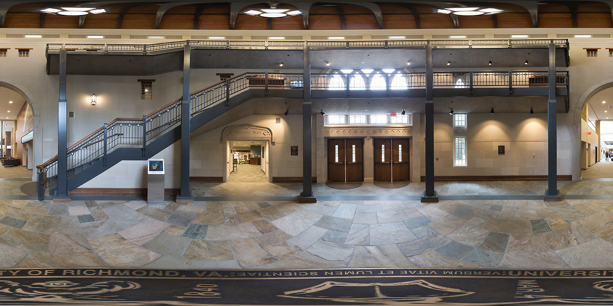

### Perspective Distortion
Perspective Distortion is linear perspective. Things get bigger as they get closer to the viewer. Things that are further away are smaller. That's all perspective distortion is.

I am separating it from the above section on linear perspective because I want to emphasize the difference in creating vanishing points and a grounded spacial environment with repetative objects, and making objects appear closer or further by making them bigger or smaller.

When things that are different distances appear to interact with each other, our sense of perspective can be completley broken. This is a "forced perspective" illusion, and a rather fun photography trick to try. You've seen the "pushing the leaning tower of pisa" photos.

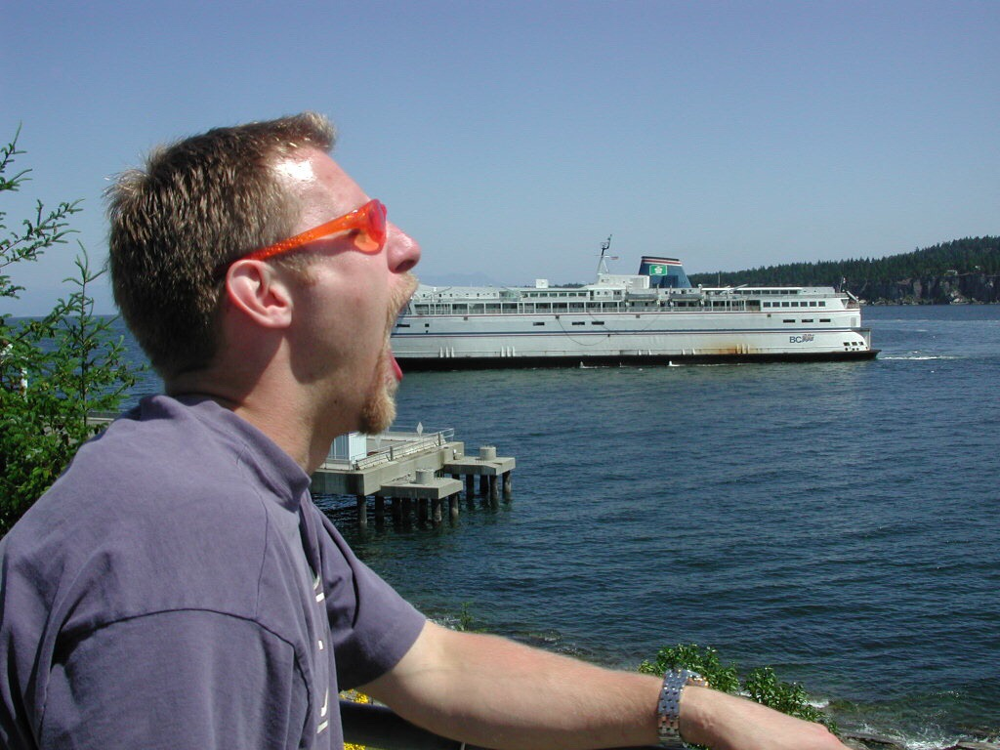
*Duane Stormy - Forced Perspective*

### Motion Parallax
Moving Objects
Head Movement

*Dust motes*

### Object Motion
Consider parallax to be the motion of the camera, or consistently moving things, that provide a sense of scale. **Object Motion** refers to the motion of objects. Big things move and accelerate slowly. Small and lightweight things dart around. A big door lumbers open and a floppy wooden saloon door ... flops.

This is an important design consideration when having objects accuratley *feel* like their size, particularly things one interacts with, but is also important in environmental design, and establishing space. In a game engine, this tends to be the tedious task of making sure the object properties are set up well in a physics engine, or animated appropriately.

*See the tilt-shift videography example below.*

### Frame
When an object is so large it can't be contained inside of a frame, we tend to assume it is large. This is... clear. 

This isn't really a spacial depth cue in the same way that others are, but it's an important enough quality that should be thought about in the same way as these other depth cues.

In VR, one may think we don't have a frame. But... the user can't see the entire world all at once. There's a frame. Large objects that extend outside of ones field of view will feel large, while objects we can observe without moving our heads will feel smaller.

Consider the opening shot of Star Wars for an incredibly effective example.

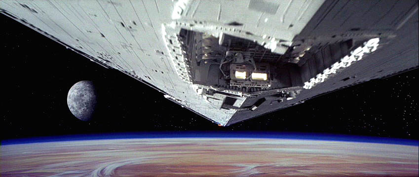

*The shot creates our expectations of scale - first with the small ship, and then with the point of the larger one moving past. It quickly subverts that expectation: the ship just keeps going! It takes up more and more of the frame. The viewer is forced to continuously readjust their mental model of how big this ship probably is, which makes it feel all the larger. It's a [great shot](https://youtu.be/yHfLyMAHrQE?t=119).*

### Familiar Size/Relative Size (Reference)
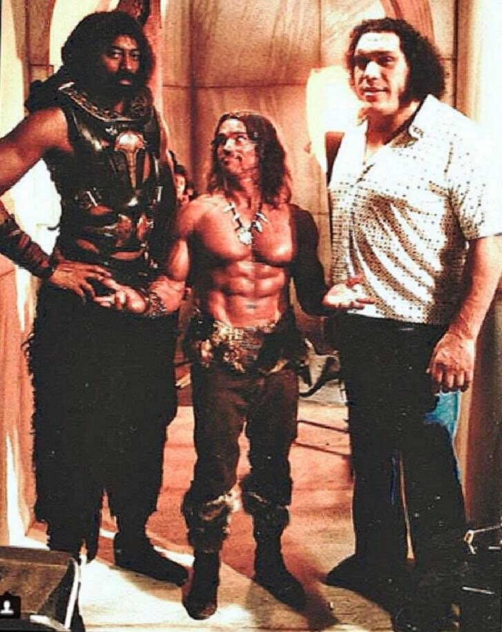

Guess who is in the center of this image? How tall do you think they are?

That's Arnold Schwarzenegger, who is around 6 feet tall. In this image he is flanked by Professional basketball player Wilt Chamberlin (7ft) and Wrestler/Actor Andre The Giant (7ft 4in) on the set of *Conan The Destroyer*. Notice how we don't have other objects in the image that are clear enough to provide reference, and we must use our knowledge of how tall people tend to be in order to understand the image. In this case, that "known size" is wrong.

[source](https://twitter.com/schwarzenegger/status/984478810400686080).

In my opinion, not giving the user relative/familiar size comparisons is one of most consistent design failings of many VR experiences. We enter fantasy worlds with fantasy environments to do fantasy things, and it just doesn't quite *feel grounded*. The only relative scale we have is our own height, which stops being effective once things are a certain distance or offset about the environment. Give me some things with known sizes in them, at various places in the world. Not 1-cubic-meter wooden crates that are rampant in video games but nobody has ever actually seen in real life. How big is a barrel? I've got no clue, they don't help me understand scale at all. Maybe toss some cars in the background? Or potted plants! Plants are great. I'm a big fan of indoor potted plants.

This image of [Greg](https://www.gregstokinger.com/) was captured on the roof of a building in Pittsburgh. There is absolutely nothing to disconnect the foreground - greg - with the background except for a small amount of blur and sharpness. Greg looks like he is the size of these buildings! Luckily our sense of relative sizes - and that small amount of blur - keep us from falling to a "forced perspective" illusion.
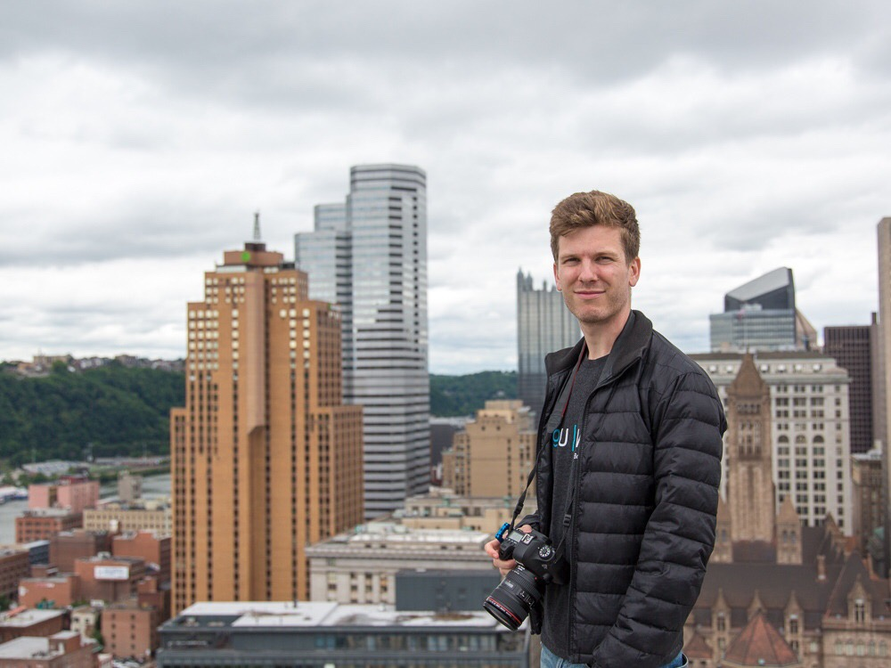

### Occlusion/Interpolation

### Shadows and Lighting

### Textures and Detail Level

### Size of Similar Objects
The same cue as perspective distortion/linear perspective and familiar size above. I want to draw emphasis on objects that may not be of a *known* size, but of some size that we establish *within the environment*, and by repeating this same object around the environment, it's size becomes an indicator of depth.

The human figures in this image very clearly solidify it's perspective and scale.
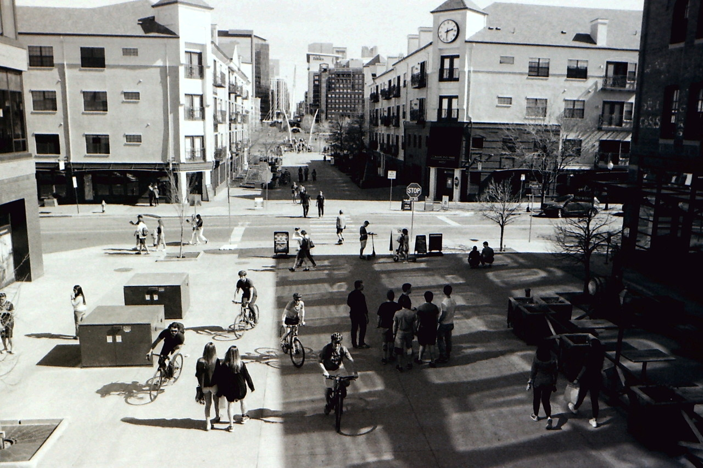

Notable examples: people, windows, streetlamps, vehicles, and so on.

Consider the tables/table lamps in the above image of the Library

The below image doesn't have very many depth cues. The metal bridge is ambiguously sized and out of frame, the road doesn't quite have all the markings of a normal street (of known size) (it's clearly smaller, it's a bike path), and turns and twists obscure any clear vanishing points. The strongest indicator of depth is the fencing, and the repetition of the fencing gives us a sense for how far away the red building is. We can more accurately estimate the distance to the building than estimate the width of the bike path.

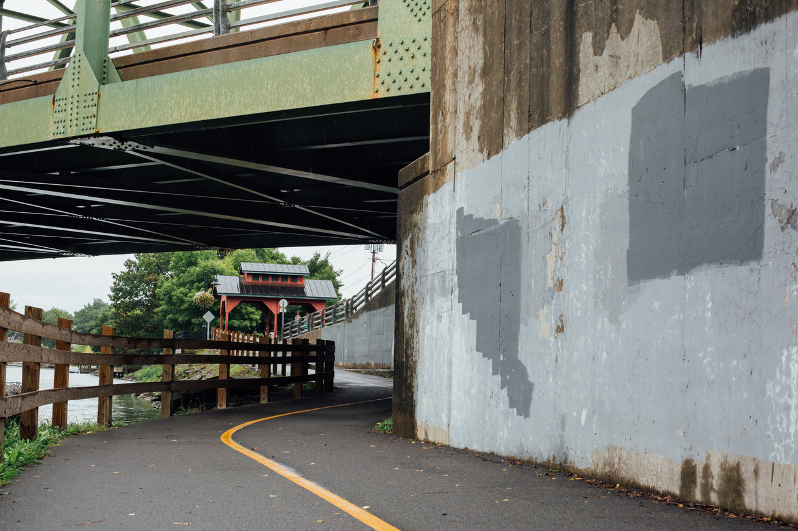

### Background-Separation ("Figure-Ground")

### Kinetic Depth Effect

The shifting of a silouette can be reconstructed as a 3 dimensional shape moving through space, and we can understand the shape being presented. We can reverse engineer this information as a 3 dimensional shape.  

<iframe width="560" height="315" src="https://www.youtube.com/embed/mkhY5lANs-k" frameborder="0" allow="accelerometer; autoplay; encrypted-media; gyroscope; picture-in-picture" allowfullscreen></iframe>

### Out-Of-Focus Blur

Our eyes focus on light (*ahem:* accomodation) in a way ery similar to

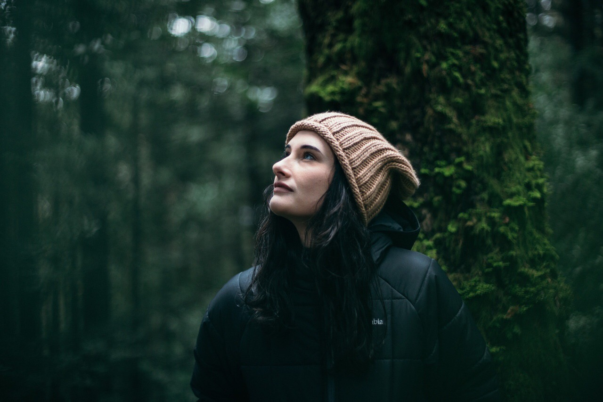
*The deep background is extremely out of focus, the tree is less out of focus, and the model is sharp and in focus. Occlusion also clues us in.*

Consider this screen capture from *The Untouchables*. 

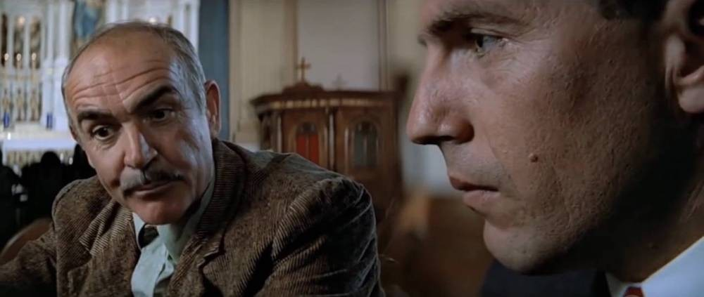

It was shot using a "split diopter". The effect is usually achieved by cutting a lens in half, perhaps combining it with another half-lens of a different focal length. This image feels fake and wrong to us (the effect is more subtle inside of the context, montage, and pacing of film, a screencapture rips it out and lays it bare). It is inconsistent with our understanding of out-of-focus blur, which we expect to be consistent.

*See the example highlighting tilt-shift photography below.*

### Elevation From The Horizon
This depth cue is a generalization of perspective. As things get further away, they tend to approach the horizon (as they approach a vanishing point). When observing objects that are not too different in height or size, distance from the horizon is an effective cue. 

### Atmospheric Gradation
Atmospheric Gradation, sometimes called "atmospheric perspective", 
Air is clear, but not that clear. There's fog, [haze](https://www.spc.noaa.gov/publications/corfidi/hazeintro.html), dust, smog, clouds, and more obscuring our ability too see long distances clearly. As an object gets further away, it's percieved contrast decreases, and it can shift towards blue, or other colors, depending. 

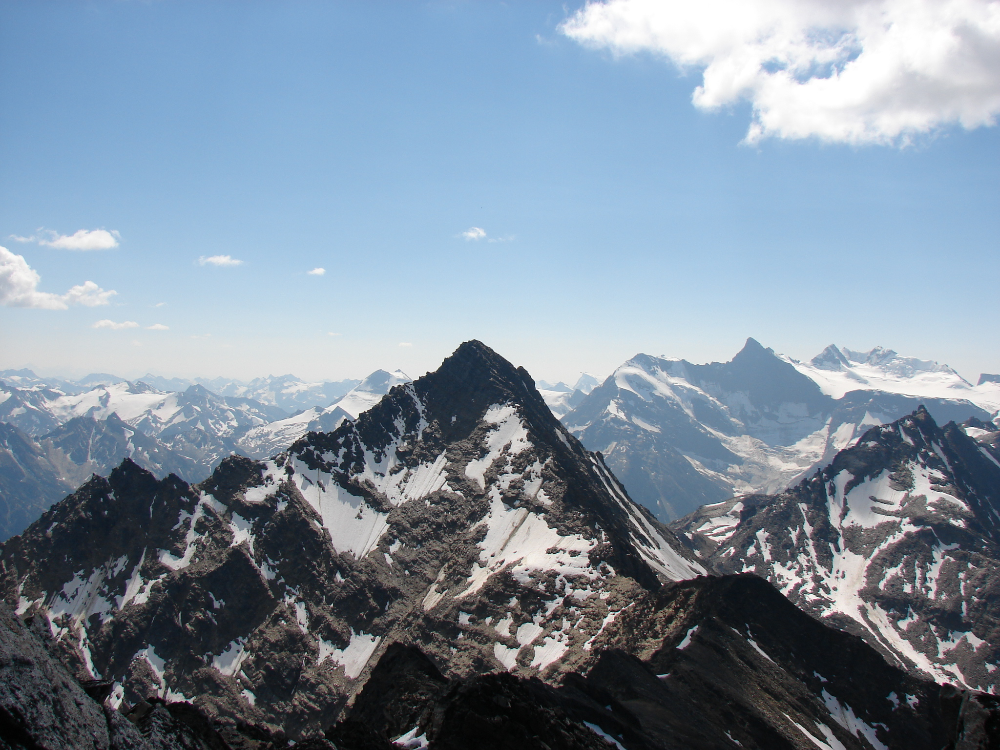
*[Peaks of the Premier Range](https://en.wikipedia.org/wiki/Cariboo_Mountains#/media/File:Cariboo_Peaks.JPG), Cariboo Mountains, from the summit of Mica Mountain, British Columbia. By Rufus Hawthorne.* Note the distant mountains lose contrast in addition to the blue tint.

Fog provides the same visual effect at a much more extreme scale.

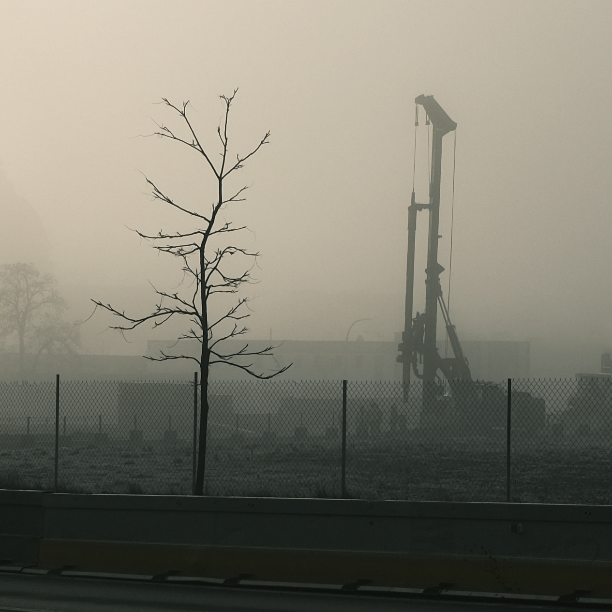
*Image shot on a foggy morning in East Liberty. Occlusion and dramatic atmospheric gradation provide depth cues.*

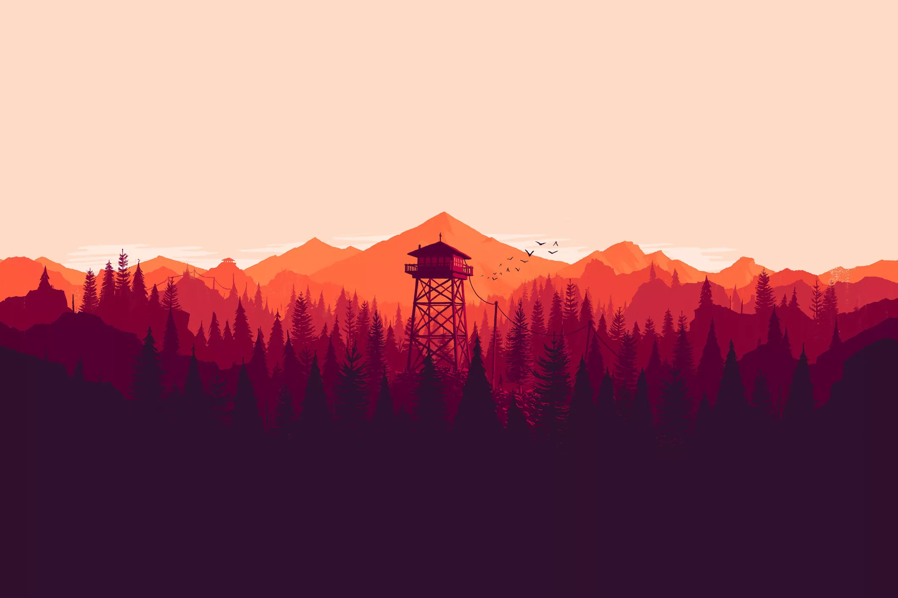
*Promotional image for the game Firewatch uses implied atmospheric gradation, as well as occlusion and horizon elevation, to present a vast vista out of a handful of solid colors*
.

This is an image I captured on a different foggy morning in Pittsburgh. Again emphasizing that fog isn't just a tint, but also a reduction in contrast.
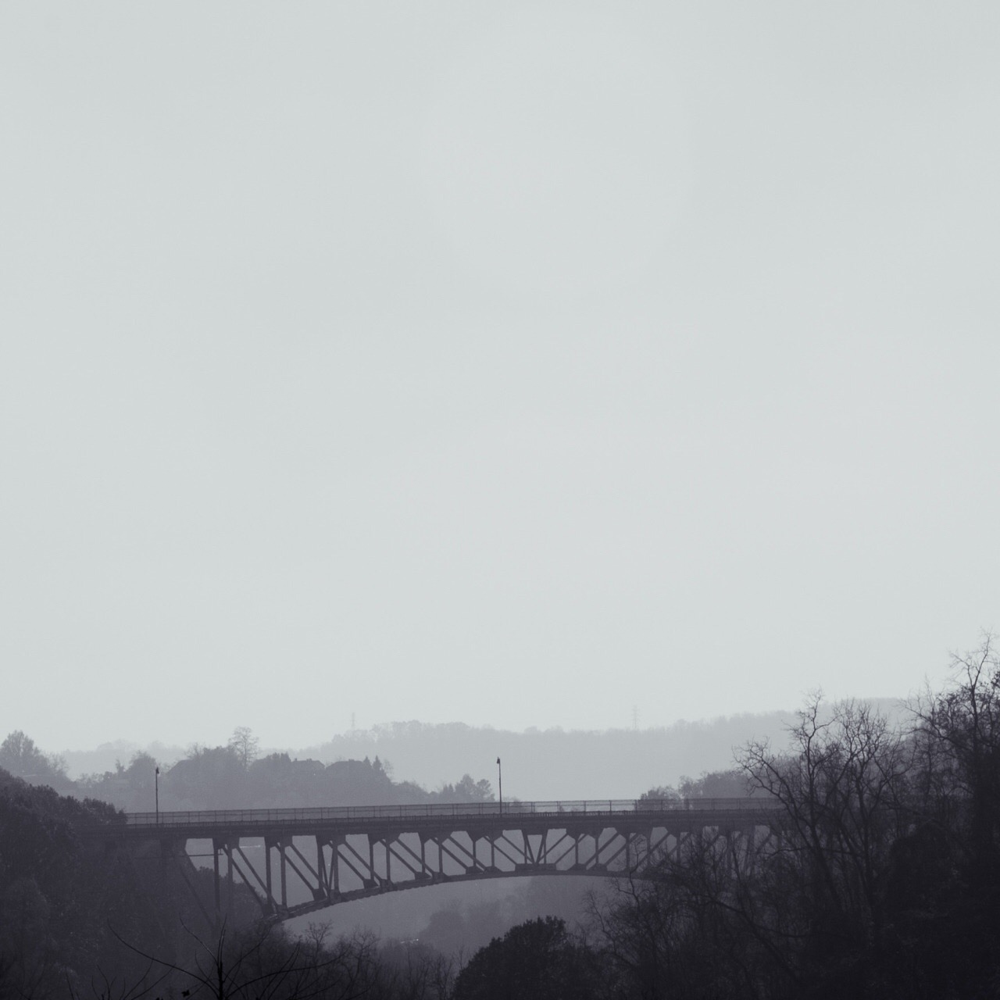.

## Examples Of Presenting Depth

### River City Girls

Beat-Em up games often mix perspective tricks with orthographic projection, presenting 3D worlds on a 2D screen, with 2D movement, in an interesting way.

<iframe width="560" height="315" src="https://www.youtube.com/embed/MDrc5Jzm2wc" frameborder="0" allow="accelerometer; autoplay; encrypted-media; gyroscope; picture-in-picture" allowfullscreen></iframe>

There is no parallax due to the orthographic projection and 2-Dimensional engine behind the scenes. How do the designers present space? What visual cues are being used here?

The two major depth cues in this game are occlusion, which is obvious. The second is vertical position.

In the gameplay, the vertical position is the *only* element that effects depth. As you "forwards and backwards" you move straight up and down. But consider the perspective presented by the background scenery. We can see the sides of many objects. It's.... wrong! But the objects are presented at such a steep projection, they enforce vertical position as being related to depth far more than horizontal position being related to depth.

In the below screenshot, the dumpster and the truck are angled opposite to each other, implying a vanishing point that is impossible with an orthographic projection - things don't get smaller when they get further away. 

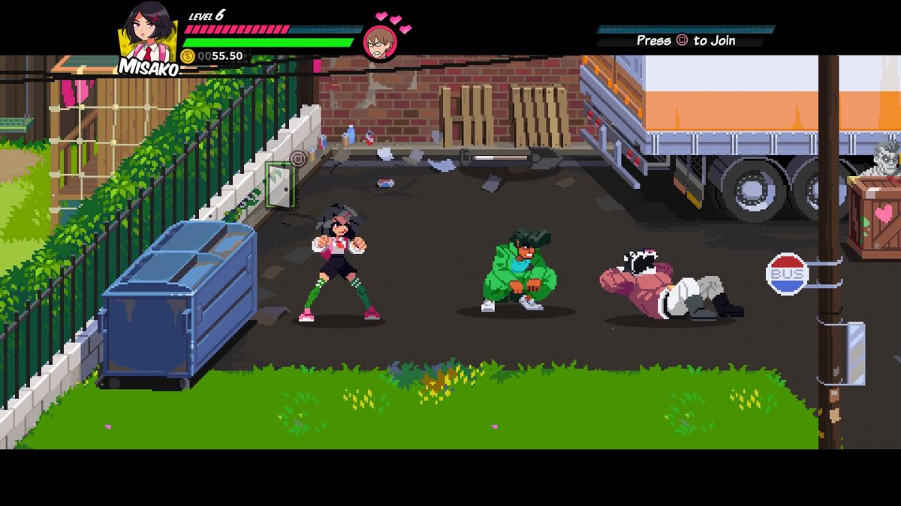

The game simplifies the world to and projection in ways that defy both perspective and orthographic projections, but it works. Everything reinforces the assumption of vertical position being related to distance. Combined with a number of reference objects, foreground objects and more. The system breaks when we have characters jump and when characters are different heights. The drop-shadow is present to provide a positional cue that relives this ambiguousness.

As a designer, it can be impossible to do things "accurately". Even in VR. We must be aware of what we can provide that present clarity to ambiguous visual clues and "override conflicting ones. 

### Animal Crossing: New Horizons

The game *Animal Crossing: New Horizons* appears to use an orthographic camera - avoiding linear perspective. No matter how far away things are, they should appear the same size. But they don't, the illusion of a 3 dimensional space is so convincing, it's hard to register the environment as "orthographic".

As objects get further from the camera, the game bends them towards the horizon, and adds a fairly significicant atmospheric gradation, and background blur. Objects will also rotate (with the ground) affecting the visibility of their various sides, depending on how far away they are. 

<iframe width="560" height="315" src="https://www.youtube.com/embed/_3YNL0OWio0" frameborder="0" allow="accelerometer; autoplay; encrypted-media; gyroscope; picture-in-picture" allowfullscreen></iframe>

### Tilt-Shift Photography
Tilt term for use of a lens that is able to rotate the focal plane by rotating either the lens or the image sensor. Shift offsets the center of the lens from the center of the image sensor and can "skew" perspective. These are called camera lens **movements**, particularly in the context of large-format photography. Most generally, it is referred to as "tilt-shift" photography. 

Tilt-shift lenses were designed to *reduce* optical and perspective distortion, but it did not take long for photographers to figure out they could manipulate the effects.

Consider this image of [Edinburgh by Scotty Becca](https://scottybecca.wordpress.com/2011/01/26/edinburgh-in-miniature/).
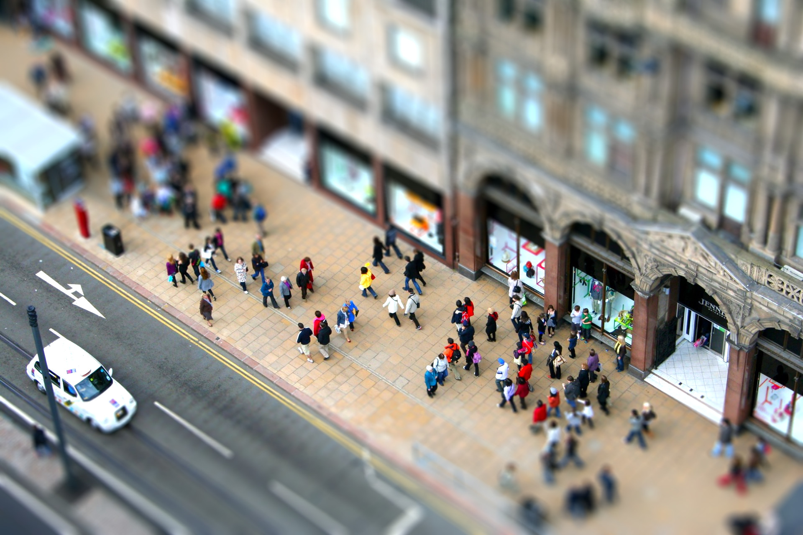

How big are those people? They look miniature! Is this a toy set?

Tilt-shift effects like this do a number of things to manipulate our ability to perceive space. Most significantly, the focal plan is tilted. Our brain expects things that are out of focus to be further away, in uniform with the degree of blur. The tilted focal plan distorts this expectation. We can make sense of it, however. This type of blur would be apparent if the subjects were miniature, and we were very close to them. (out of focus blur increases as focal distance decreases). So the blur gives the impression of a very close focal distance.

The "shift" part of tilt shift can also come into play, offsetting linear perspective cues, and causing lines that would approach a vanishing point quickly to approach it much slower.

But tilt-shift lenses do not always produce a miniature effect. The illusion only works if other conditions are met: Other depth cues need to be ignored. Most notably that's linear perspective - and perspective distortion.

The illusion that are most effective are almost always from a high vantage point looking down or out, and of distant subjects. This minimizes perspective distortion. As objects move about the frame, they don't get that much closer or further from the camera, and they don't change in size very much. Believable tilt-shift illusion photographs rarely have objects that are actually very close to the camera.

The effect can also be reinforced when combined with time-lapse or sped-up videography. Time-lapse makes large, slow-moving objects move and accelerate quickly, and already fast or erratic moving objects tend to zip around. More closely emulating the behavior we might expect from something miniature, acting more like a light plastic toy truck instead of the real thing. The entertaining short films of [Joerg Daiber](https://vimeo.com/spoonfilm) showcase this.

<iframe src="https://player.vimeo.com/video/384478574" width="640" height="360" frameborder="0" allow="autoplay; fullscreen" allowfullscreen></iframe>

<a href="https://vimeo.com/384478574">The Essence of Athens (4k - Time lapse -Tilt Shift)</a> from <a href="https://vimeo.com/spoonfilm">Joerg Daiber</a> on <a href="https://vimeo.com">Vimeo</a>.

## Interesting/Related
- Lightfield sensors are a different, interesting, approach to sensing light.
- [Accommodation-Convergence Reflex](https://en.wikipedia.org/wiki/Accommodation_reflex)
- [GDC Talk on The Art of Firewatch](https://www.youtube.com/watch?v=SdxQ3HlhTE8)